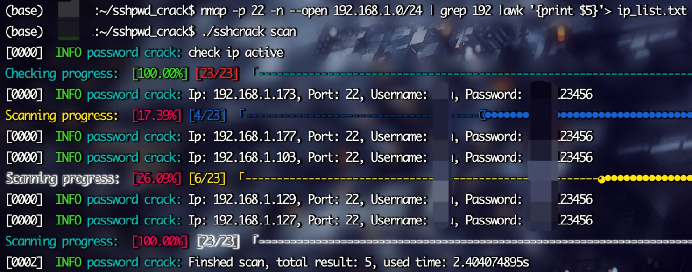
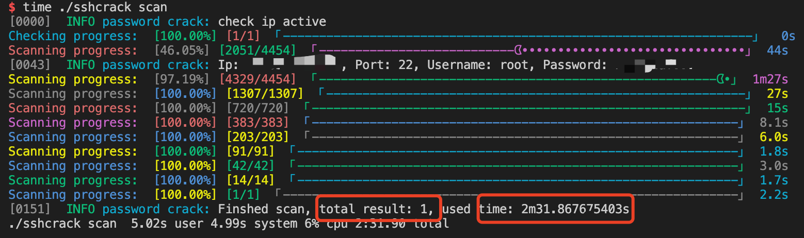
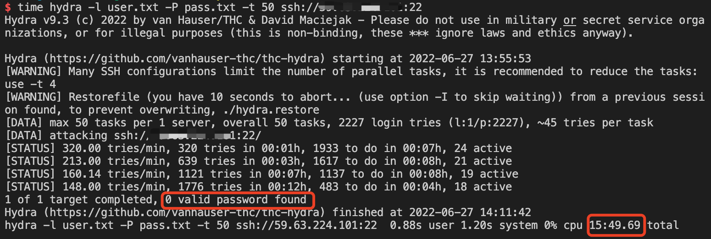

# 工具介绍
一款由golang编写的高并发ssh爆破工具，主要优点在于

1、破解速度快

2、对于线程数过大时，会产生大量的tcp连接，导致产生connection reset by peer等非密码错误型报错，该工具加入重新扫描策略，避免出现漏报的情况。

错误pattern可以根据debug结果进行设置

设置错误pattern: reScanStrs.conf

```
connection reset by peer
Timeout
EOF
```

3、加入平滑协程控制，避免协程突然大量启动而后逐渐关闭

4、可以批量对多个ip进行密码破解

5、易于安装，无需编译或编译简单

# 使用场景

一、针对ssh进行常用爆破

二、在双路由器局域网（比如校园网10.x.x.x+外网192.168.x.x）中，如果其中一台主机的其中一个网段的ip失效（因为openstack的neutron网桥断了之类的），可使用nmap在另一个网段扫描开启22端口的主机，然后将主机ip导出至ip_list.txt，然后在user.txt和pass.txt中分别设置好用户名密码，即可自动化扫描出在另一个网段符合登录账号密码的主机，登进去查看ip是否要寻找的主机ip。

```shell
nmap -p 22 -n --open 192.168.1.0/24 | grep 192 |awk '{print $5}'> ip_list.txt
```



# 编译安装

编译成linux下的可执行文件

```bash
CGO_ENABLED=0 GOOS=linux GOARCH=amd64 go build -o sshcrack
rm -rf sshpwd_crack
mkdir sshpwd_crack
cp sshcrack reScanStrs.conf sshpwd_crack/
touch sshpwd_crack/ip_list.txt
touch sshpwd_crack/user.txt
touch sshpwd_crack/pass.txt
```

# 使用方法

```
$ ./sshcrack      
NAME:
   password-crack - Weak ssh password scanner

USAGE:
   sshcrack [global options] command [command options] [arguments...]

AUTHOR:
   M1ngkvv1nd

COMMANDS:
   scan     start to crack weak password
   help, h  Shows a list of commands or help for one command

GLOBAL OPTIONS:
   --debug, -d                   debug mode
   --time value, -t value        timeout (default: 3)
   --thread_num value, -n value  thread num (default: 50)
   --ip_list value, -i value     iplist (default: "ip_list.txt")
   --user_dict value, -u value   user dict (default: "user.txt")
   --pass_dict value, -p value   password dict (default: "pass.txt")
   --outfile value, -o value     scan result file (default: "pass_crack.txt")
   --help, -h                    show help
```

# 性能对比

和hydra进行对比





可以看出sshcrack破解速度比hydara快了6倍，且不会存在漏报的情况
